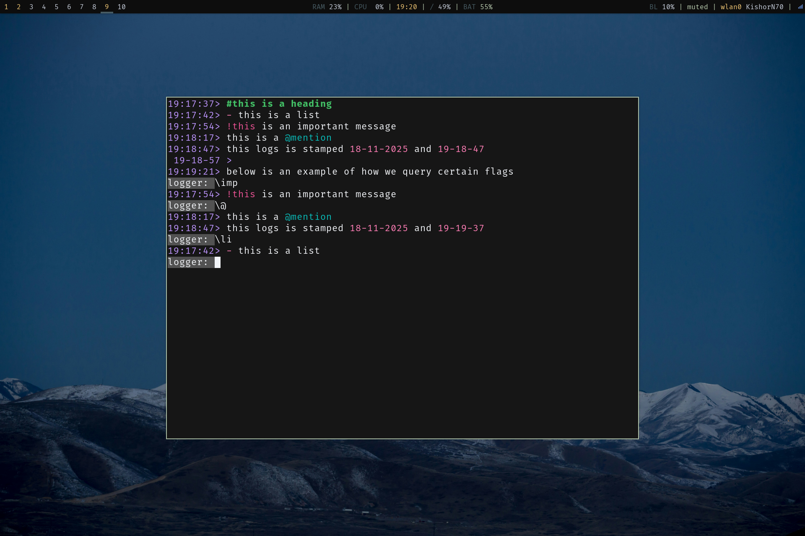

# atomLog - Minimal CLI logger



**atomLog** is a minimal CLI logger designed to enhance productivity. It stores information in daily `.json` files, allowing for easy querying by date and time, and supports rich text formatting through simple syntax.

## Installation

```bash
# Build the binary
mkdir -p build
go build -o build/atomlogger

# Install to local bin (ensure ~/.local/bin is in your PATH)
cp build/atomlogger ~/.local/bin/
```

## Usage
Run `atomlogger` to start the session. Simply type your text and hit Enter to log it.

### Commands & Syntax

| Input | Function |
| :--- | :--- |
| **General** | |
| `print` | Display the last 5 log entries |
| `exit` / `q` | Save and quit the application |
| **Formatting** | |
| `!text` | Mark text as **Important** (Red) |
| `@text` | Mark text as a **Mention** (Cyan) |
| `#text` | Format line as a **Heading** (Green, must be at start) |
| `- text` | Format line as a **List Item** (Yellow dash) |
| `@date` / `@time` | Auto-replace with current date or time |
| **Filters** | |
| `\imp` / `\!` | Filter and show all **Important** logs (`!`) |
| `\mention` / `\@` | Filter and show all **Mentions** (`@`) |
| `\head` / `\#` | Filter and show all **Headings** (`#`) |
| `\list` / `\li` | Filter and show all **List** items (`-`) |

